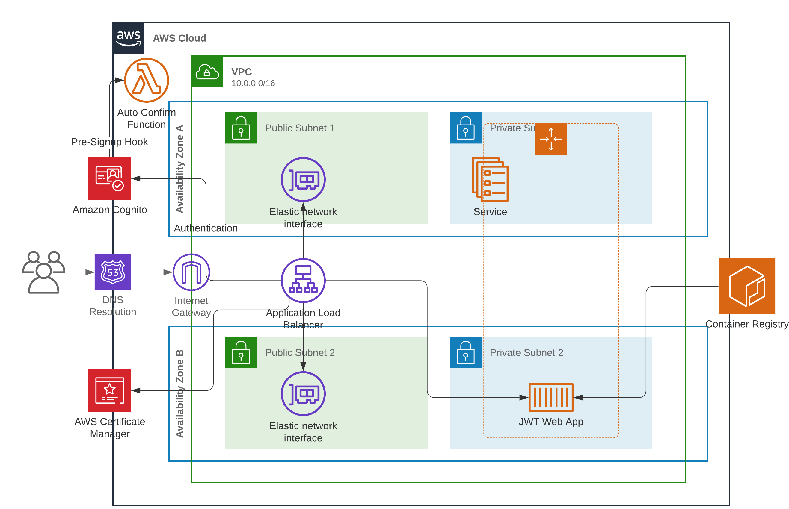

# User Management with Cognito, Fargate, Python and the CDK

This demo has been built for the [German AWS Community Day 2020](https://www.aws-community-day.de/) and is based on my articles on Cognito on the tecRacer AWS Blog:

- [Machine to Machine Authentication with Cognito and Serverless](https://aws-blog.de/2020/01/machine-to-machine-authentication-with-cognito-and-serverless.html)
- [Building a Fargate-based container app with Cognito Authentication](https://aws-blog.de/2020/03/building-a-fargate-based-container-app-with-cognito-authentication.html)

When I get the chance I'll write another article based on what changed since the release of the second article in march 2020, because things have been getting a tiny bit easier.

If you're interested in the other things I do or work on I suggest you check out:

- The [tecRacer AWS Blog](https://aws-blog.de) where I occasionally blog
- My [personal blog](https://mauricebrg.com/)
- My Twitter account [@Maurice_Brg](https://twitter.com/@maurice_brg)

Back to the code...

---

The code in this repo sets up the following architecture:

- A VPC across 2 AZs with internet connectivity for both kinds of subnets (this means NAT Gateways that aren't shown on the diagram are provisioned as well)
- A backend application running inside a Docker container which gets provisioned by the CDK and runs in an ECS Service on top of Fargate
- A Cognito user pool to hold users and let users authenticate against
  - A lambda function that automatically confirms all users (Pre-Sign-Up hook)
- An Application Load Balancer that sits in front of the backend application and authenticates users against Cognito before traffic may pass to the backend
- Several entries in a hosted Zone of your choice, which route traffic to the ALB and confirm a certificate for the endpoint in that zone

## Prerequisites

- Your own Hosted Zone
- AWS CDK version >= 1.62
- Python version >= 3.7
- Docker should be available

## Deployment Steps

- Clone the repository
- Initialize a new virtual environment for python: `python -m venv .env` (Make sure it's python3)
- Activate the virtual environment: `source .env\bin\activate`
- Install the dependencies: `pip install -r requirements.txt`
- Open the `configuration.ini` and update it with the values that suit your environment (the comments should be fairly helpful)
- Run `cdk synth` to make sure everything works correctly.
- Run `cdk deploy` to deploy the webapp
- Open the domain that you configured in your webapp in a browser of your choice and register an account

**Done!**

## Demo Ideas

Things you can show with this setup:

- Integration between Cognito and the ALB
- Lambda Triggers in Cognito
- Scaling up the webapp (desired capacity in the config)
- Building docker containers with the CDK
